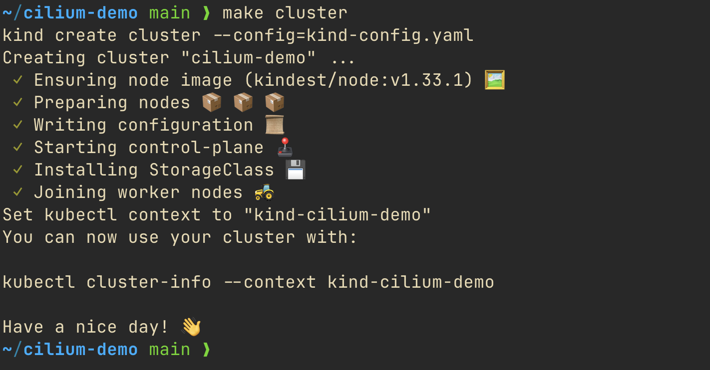
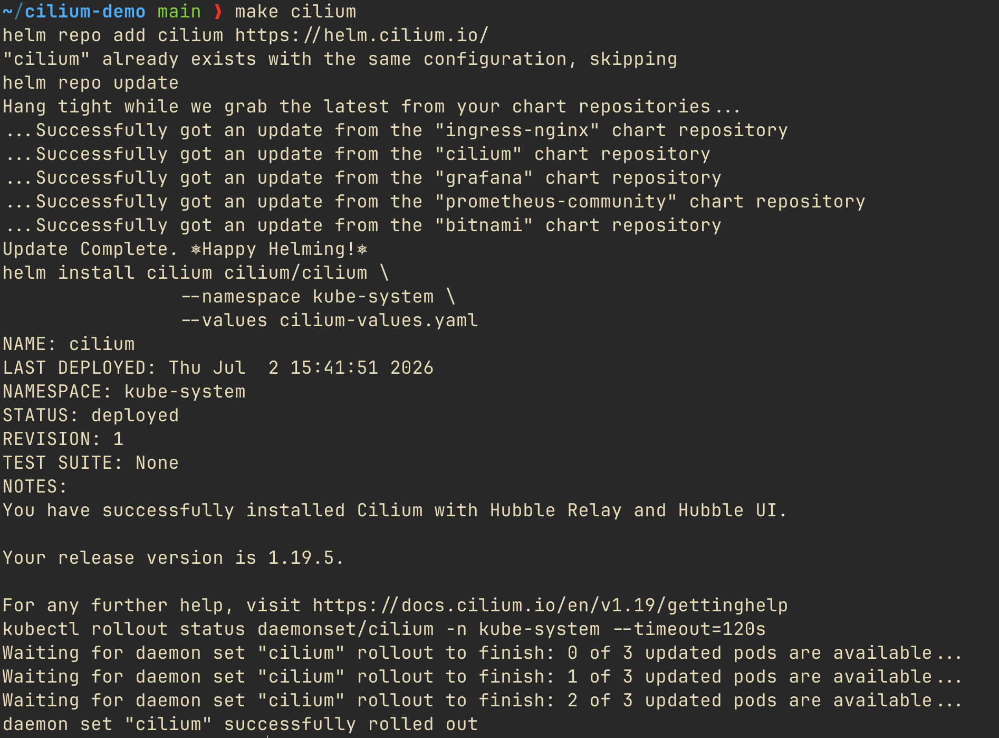
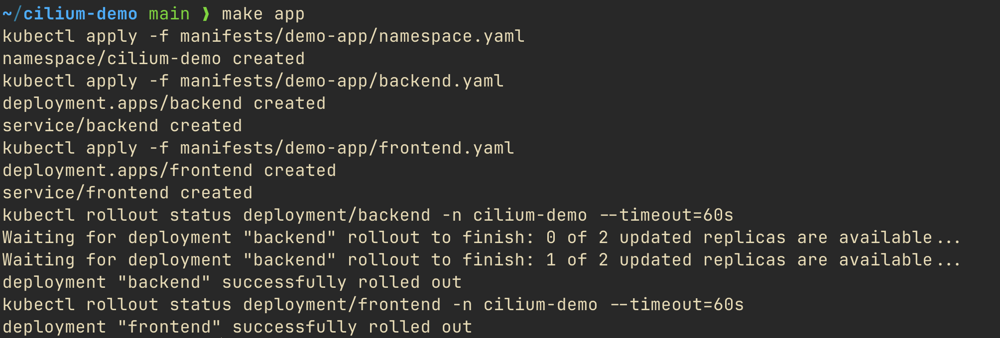
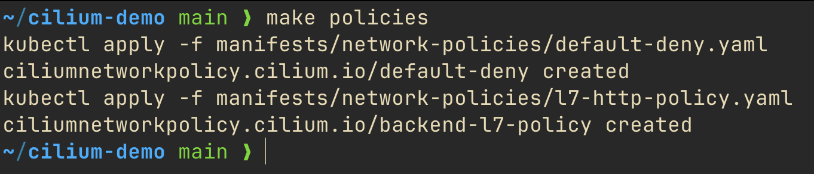
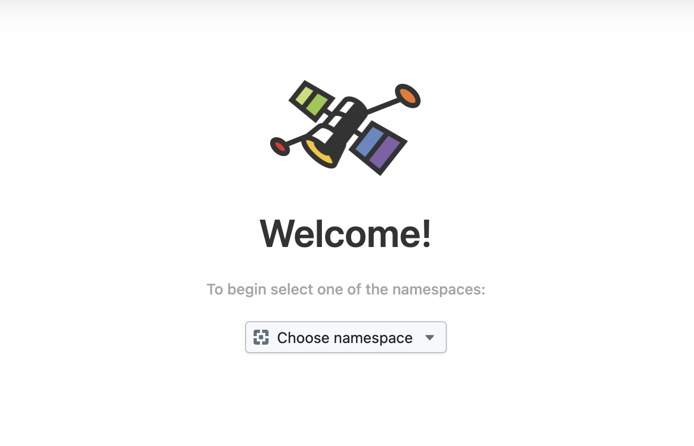
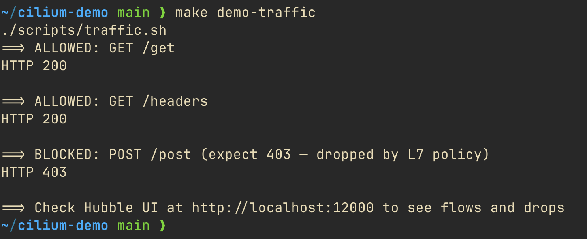
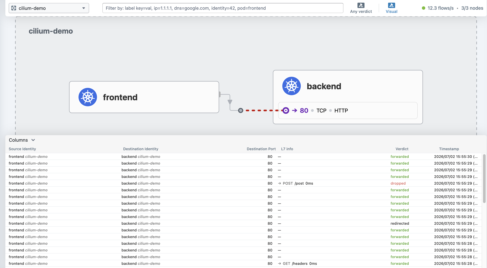
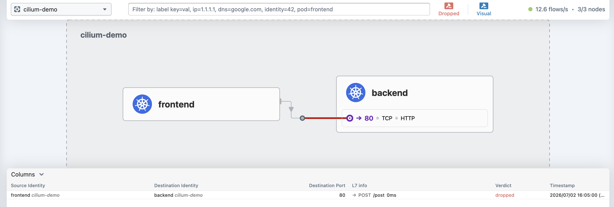
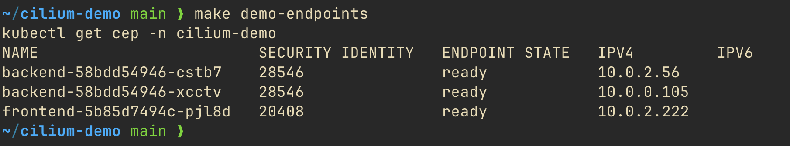

# cilium-demo

Hands-on demo of Cilium CNI on a local Kind cluster.

Demonstrates:
- **Hubble** — real-time network flow visibility and service map
- **eBPF dataplane** — kernel-level programs replacing iptables and kube-proxy
- **L7 network policies** — allow/block traffic at HTTP method and path level
- **VXLAN overlay** — pod-to-pod traffic across nodes
- **Kube-proxy replacement** — services handled via eBPF hash tables

## Prerequisites

- [Docker](https://docs.docker.com/get-docker/) — must be running
- [Kind](https://kind.sigs.k8s.io/docs/user/quick-start/#installation)
- [Helm](https://helm.sh/docs/intro/install/)
- [kubectl](https://kubernetes.io/docs/tasks/tools/)

## Setup

### 1. Create Kind cluster

```bash
make cluster
```

Creates a 3-node cluster (1 control-plane + 2 workers) with the default CNI disabled. Cilium will be the sole CNI.



### 2. Install Cilium

```bash
make cilium
```

Installs Cilium via Helm with VXLAN overlay, kube-proxy replacement, and Hubble enabled. Waits until the Cilium DaemonSet is ready on all nodes.



### 3. Deploy demo app

```bash
make app
```

Deploys two services in namespace `cilium-demo`:
- `frontend` — curl pod that generates HTTP traffic
- `backend` — httpbin pod (2 replicas, spread across nodes)



### 4. Wait for Cilium CRDs

> **Important:** run this before applying network policies. Cilium needs time to register its CRDs after installation.

```bash
kubectl wait --for=condition=established crd/ciliumnetworkpolicies.cilium.io --timeout=60s
```

### 5. Apply network policies

```bash
make policies
```

Applies three `CiliumNetworkPolicy` resources:

| Policy | Effect |
|--------|--------|
| `default-deny` | Denies all ingress and egress in `cilium-demo` by default |
| `backend-l7-policy` | Allows only `GET /get` and `GET /headers` from frontend to backend |
| `frontend-egress` | Allows frontend to reach backend on port 80 and CoreDNS on UDP 53 |



### 6. Open Hubble UI

```bash
make hubble
```

Port-forwards Hubble UI to `http://localhost:12000`. Keep this terminal open and open the URL in your browser. Select namespace `cilium-demo`.



## Demo

Run the following in a **separate terminal** while Hubble UI is open.

### Traffic

```bash
make demo-traffic
```

Sends three HTTP requests from `frontend` to `backend`:

| Request | HTTP Code | Verdict |
|---------|-----------|---------|
| `GET /get` | 200 | ✅ allowed by L7 policy |
| `GET /headers` | 200 | ✅ allowed by L7 policy |
| `POST /post` | 403 | ❌ blocked by L7 policy |

Cilium enforces this at L7 — it inspects the HTTP method and path, not just IP and port.



### Hubble — Visual mode

Select namespace `cilium-demo` in Hubble UI to see the live service map. Green flows are forwarded, red flows are dropped.



### Hubble — Dropped flows

Click **"Any verdict"** → select **"Dropped"** to see only blocked traffic. The red line shows `POST /post` being dropped at L7.



### eBPF programs

```bash
make demo-ebpf
```

Shows inside the Cilium pod:
- eBPF programs loaded into the Linux kernel (`sched_cls` hooks) — intercept and process all pod traffic without iptables
- Cilium endpoint list — every pod is an endpoint with ingress/egress policy enforcement
- Active network policies in JSON

### Cilium endpoints

```bash
make demo-endpoints
```

Lists all Cilium endpoints in `cilium-demo` with security identity and IP.



## Cleanup

```bash
make clean
```

Deletes the Kind cluster and all resources.